# amused


<sup><sub>Images cherry-picked from 512 and 256 models. Images are degraded to load faster. See ./assets/collage_full.png for originals</sub></sup>

[[Paper - TODO]]()

| Model | Params |
|-------|--------|
| [amused-256](https://huggingface.co/amused/amused-256) | 603M |
| [amused-512](https://huggingface.co/amused/amused-512) | 608M |

Amused is a lightweight text to image model based off of the [muse](https://arxiv.org/pdf/2301.00704.pdf) architecture. Amused is particularly useful in applications that require a lightweight and fast model such as generating many images quickly at once.

Amused is a vqvae token based transformer that can generate an image in fewer forward passes than many diffusion models. In contrast with muse, it uses the smaller text encoder clip instead of t5. Due to its small parameter count and few forward pass generation process, amused can generate many images quickly. This benefit is seen particularly at larger batch sizes. 

## 1. Usage

### Text to image

#### 256x256 model

```python
import torch
from diffusers import AmusedPipeline

pipe = AmusedPipeline.from_pretrained(
    "amused/amused-256", variant="fp16", torch_dtype=torch.float16
)
pipe = pipe.to("cuda")

prompt = "cowboy"
image = pipe(prompt, generator=torch.Generator('cuda').manual_seed(8)).images[0]
image.save('text2image_256.png')
```


#### 512x512 model

```python
import torch
from diffusers import AmusedPipeline

pipe = AmusedPipeline.from_pretrained(
    "amused/amused-512", variant="fp16", torch_dtype=torch.float16
)
pipe = pipe.to("cuda")

prompt = "summer in the mountains"
image = pipe(prompt, generator=torch.Generator('cuda').manual_seed(2)).images[0]
image.save('text2image_512.png')
```


### Image to image

#### 256x256 model

```python
import torch
from diffusers import AmusedImg2ImgPipeline
from diffusers.utils import load_image

pipe = AmusedImg2ImgPipeline.from_pretrained(
    "amused/amused-256", variant="fp16", torch_dtype=torch.float16
)
pipe = pipe.to("cuda")

prompt = "apple watercolor"
input_image = (
    load_image(
        "https://raw.githubusercontent.com/huggingface/amused/main/assets/image2image_256_orig.png"
    )
    .resize((256, 256))
    .convert("RGB")
)

image = pipe(prompt, input_image, strength=0.7, generator=torch.Generator('cuda').manual_seed(3)).images[0]
image.save('image2image_256.png')
```

 

#### 512x512 model

```python
import torch
from diffusers import AmusedImg2ImgPipeline
from diffusers.utils import load_image

pipe = AmusedImg2ImgPipeline.from_pretrained(
    "amused/amused-512", variant="fp16", torch_dtype=torch.float16
)
pipe = pipe.to("cuda")

prompt = "winter mountains"
input_image = (
    load_image(
        "https://raw.githubusercontent.com/huggingface/amused/main/assets/image2image_512_orig.png"
    )
    .resize((512, 512))
    .convert("RGB")
)

image = pipe(prompt, input_image, generator=torch.Generator('cuda').manual_seed(15)).images[0]
image.save('image2image_512.png')
```

 

### Inpainting

#### 256x256 model

```python
import torch
from diffusers import AmusedInpaintPipeline
from diffusers.utils import load_image
from PIL import Image

pipe = AmusedInpaintPipeline.from_pretrained(
    "amused/amused-256", variant="fp16", torch_dtype=torch.float16
)
pipe = pipe.to("cuda")

prompt = "a man with glasses"
input_image = (
    load_image(
        "https://raw.githubusercontent.com/huggingface/amused/main/assets/inpainting_256_orig.png"
    )
    .resize((256, 256))
    .convert("RGB")
)
mask = (
    load_image(
        "https://raw.githubusercontent.com/huggingface/amused/main/assets/inpainting_256_mask.png"
    )
    .resize((256, 256))
    .convert("L")
)    

for seed in range(20):
    image = pipe(prompt, input_image, mask, generator=torch.Generator('cuda').manual_seed(seed)).images[0]
    image.save(f'inpainting_256_{seed}.png')

```

  

#### 512x512 model

```python
import torch
from diffusers import AmusedInpaintPipeline
from diffusers.utils import load_image

pipe = AmusedInpaintPipeline.from_pretrained(
    "amused/amused-512", variant="fp16", torch_dtype=torch.float16
)
pipe = pipe.to("cuda")

prompt = "fall mountains"
input_image = (
    load_image(
        "https://raw.githubusercontent.com/huggingface/amused/main/assets/inpainting_512_orig.jpeg"
    )
    .resize((512, 512))
    .convert("RGB")
)
mask = (
    load_image(
        "https://raw.githubusercontent.com/huggingface/amused/main/assets/inpainting_512_mask.png"
    )
    .resize((512, 512))
    .convert("L")
)
image = pipe(prompt, input_image, mask, generator=torch.Generator('cuda').manual_seed(0)).images[0]
image.save('inpainting_512.png')
```

 
 


## 2. Performance

Amused inherits performance benefits from original [muse](https://arxiv.org/pdf/2301.00704.pdf). 

1. Parallel decoding: The model follows a denoising schedule that aims to unmask some percent of tokens at each denoising step. At each step, all masked tokens are predicted, and some number of tokens that the network is most confident about are unmasked. Because multiple tokens are predicted at once, we can generate a full 256x256 or 512x512 image in around 12 steps. In comparison, an autoregressive model must predict a single token at a time. Note that a 256x256 image with the 16x downsampled VAE that muse uses will have 256 tokens.

2. Fewer sampling steps: Compared to many diffusion models, muse requires fewer samples.

Additionally, amused uses the smaller CLIP as its text encoder instead of T5 compared to muse. Amused is also smaller with ~600M params compared the largest 3B param muse model. Note that being smaller, amused produces comparably lower quality results.


### Muse performance knobs

|                     | Uncompiled Transformer + regular attention | Uncompiled Transformer + flash attention (ms) | Compiled Transformer (ms) | Speed Up |
|---------------------|--------------------------------------------|-------------------------|----------------------|----------|
| 256 Batch Size 1    |                594.7                      |         507.7                |    212.1                  |   58%       |
| 512 Batch Size 1    |                637                      |        547                 |       249.9               |     54%     |
| 256 Batch Size 8    |                719                      |        628.6                 |        427.8              |    32%      |
| 512 Batch Size 8    |                  1000                    |         917.7                |       703.6               |    23%      |

Flash attention is enabled by default in the diffusers codebase through torch `F.scaled_dot_product_attention`

### torch.compile
To use torch.compile, simply wrap the transformer in torch.compile i.e.

```python
pipe.transformer = torch.compile(pipe.transformer)
```

Full snippet:

```python
import torch
from diffusers import AmusedPipeline

pipe = AmusedPipeline.from_pretrained(
    "amused/amused-256", variant="fp16", torch_dtype=torch.float16
)

# HERE use torch.compile
pipe.transformer = torch.compile(pipe.transformer)

pipe = pipe.to("cuda")

prompt = "cowboy"
image = pipe(prompt, generator=torch.Generator('cuda').manual_seed(8)).images[0]
image.save('text2image_256.png')
```

## 3. Training

Amused can be finetuned on simple datasets relatively cheaply and quickly. Using 8bit optimizers, lora, and gradient accumulation, amused can be finetuned with as little as 5.5 GB. Here are a set of examples for finetuning amused on some relatively simple datasets. These training recipies are aggressively oriented towards minimal resources and fast verification -- i.e. the batch sizes are quite low and the learning rates are quite high. For optimal quality, you will probably want to increase the batch sizes and decrease learning rates.

All training examples use fp16 mixed precision and gradient checkpointing. We don't show 8 bit adam + lora as its about the same memory use as just using lora (bitsandbytes uses full precision optimizer states for weights below a minimum size).

### Finetuning the 256 checkpoint

These examples finetune on this [nouns](https://huggingface.co/datasets/m1guelpf/nouns) dataset.

Example results:

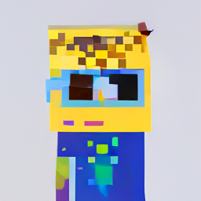 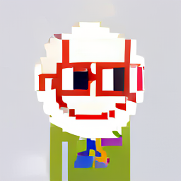 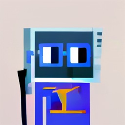

#### Full finetuning

Batch size: 8, Learning rate: 1e-4, Gives decent results in 750-1000 steps

| Batch Size | Gradient Accumulation Steps | Effective Total Batch Size | Memory Used |
|------------|-----------------------------|------------------|-------------|
|    8        |          1                   |     8             |      19.7 GB       |
|    4        |          2                   |     8             |      18.3 GB       |
|    1        |          8                   |     8             |      17.9 GB       |

```sh
accelerate launch training/train_amused.py \
    --output_dir <output path> \
    --train_batch_size <batch size> \
    --gradient_accumulation_steps <gradient accumulation steps> \
    --learning_rate 1e-4 \
    --pretrained_model_name_or_path amused/amused-256 \
    --instance_data_dataset  'm1guelpf/nouns' \
    --image_key image \
    --prompt_key text \
    --resolution 256 \
    --mixed_precision fp16 \
    --lr_scheduler constant \
    --validation_prompts \
        'a pixel art character with square red glasses, a baseball-shaped head and a orange-colored body on a dark background' \
        'a pixel art character with square orange glasses, a lips-shaped head and a red-colored body on a light background' \
        'a pixel art character with square blue glasses, a microwave-shaped head and a purple-colored body on a sunny background' \
        'a pixel art character with square red glasses, a baseball-shaped head and a blue-colored body on an orange background' \
        'a pixel art character with square red glasses' \
        'a pixel art character' \
        'square red glasses on a pixel art character' \
        'square red glasses on a pixel art character with a baseball-shaped head' \
    --max_train_steps 10000 \
    --checkpointing_steps 500 \
    --validation_steps 250 \
    --gradient_checkpointing
```

#### Full finetuning + 8 bit adam

Note that this training config keeps the batch size low and the learning rate high to get results fast with low resources. However, due to 8 bit adam, it will diverge eventually. If you want to train for longer, you will have to up the batch size and lower the learning rate.

Batch size: 16, Learning rate: 2e-5, Gives decent results in ~750 steps

| Batch Size | Gradient Accumulation Steps | Effective Total Batch Size | Memory Used |
|------------|-----------------------------|------------------|-------------|
|    16        |          1                   |     16             |      20.1 GB       |
|    8        |          2                   |      16           |      15.6 GB       |
|    1        |          16                   |     16            |      10.7 GB       |

```sh
accelerate launch training/train_amused.py \
    --output_dir <output path> \
    --train_batch_size <batch size> \
    --gradient_accumulation_steps <gradient accumulation steps> \
    --learning_rate 2e-5 \
    --use_8bit_adam \
    --pretrained_model_name_or_path amused/amused-256 \
    --instance_data_dataset  'm1guelpf/nouns' \
    --image_key image \
    --prompt_key text \
    --resolution 256 \
    --mixed_precision fp16 \
    --lr_scheduler constant \
    --validation_prompts \
        'a pixel art character with square red glasses, a baseball-shaped head and a orange-colored body on a dark background' \
        'a pixel art character with square orange glasses, a lips-shaped head and a red-colored body on a light background' \
        'a pixel art character with square blue glasses, a microwave-shaped head and a purple-colored body on a sunny background' \
        'a pixel art character with square red glasses, a baseball-shaped head and a blue-colored body on an orange background' \
        'a pixel art character with square red glasses' \
        'a pixel art character' \
        'square red glasses on a pixel art character' \
        'square red glasses on a pixel art character with a baseball-shaped head' \
    --max_train_steps 10000 \
    --checkpointing_steps 500 \
    --validation_steps 250 \
    --gradient_checkpointing
```

#### Full finetuning + lora

Batch size: 16, Learning rate: 8e-4, Gives decent results in 1000-1250 steps

| Batch Size | Gradient Accumulation Steps | Effective Total Batch Size | Memory Used |
|------------|-----------------------------|------------------|-------------|
|    16        |          1                   |     16             |      14.1 GB       |
|    8        |          2                   |      16           |      10.1 GB       |
|    1        |          16                   |     16            |      6.5 GB       |

```sh
accelerate launch training/train_amused.py \
    --output_dir <output path> \
    --train_batch_size <batch size> \
    --gradient_accumulation_steps <gradient accumulation steps> \
    --learning_rate 8e-4 \
    --use_lora \
    --pretrained_model_name_or_path amused/amused-256 \
    --instance_data_dataset  'm1guelpf/nouns' \
    --image_key image \
    --prompt_key text \
    --resolution 256 \
    --mixed_precision fp16 \
    --lr_scheduler constant \
    --validation_prompts \
        'a pixel art character with square red glasses, a baseball-shaped head and a orange-colored body on a dark background' \
        'a pixel art character with square orange glasses, a lips-shaped head and a red-colored body on a light background' \
        'a pixel art character with square blue glasses, a microwave-shaped head and a purple-colored body on a sunny background' \
        'a pixel art character with square red glasses, a baseball-shaped head and a blue-colored body on an orange background' \
        'a pixel art character with square red glasses' \
        'a pixel art character' \
        'square red glasses on a pixel art character' \
        'square red glasses on a pixel art character with a baseball-shaped head' \
    --max_train_steps 10000 \
    --checkpointing_steps 500 \
    --validation_steps 250 \
    --gradient_checkpointing
```

### Finetuning the 512 checkpoint

These examples finetune on this [minecraft](https://huggingface.co/monadical-labs/minecraft-preview) dataset.

Example results:

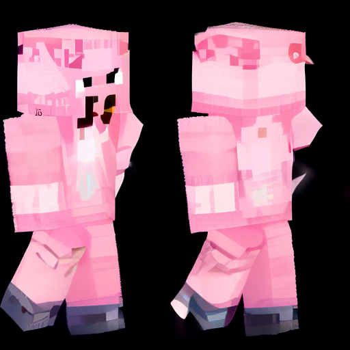 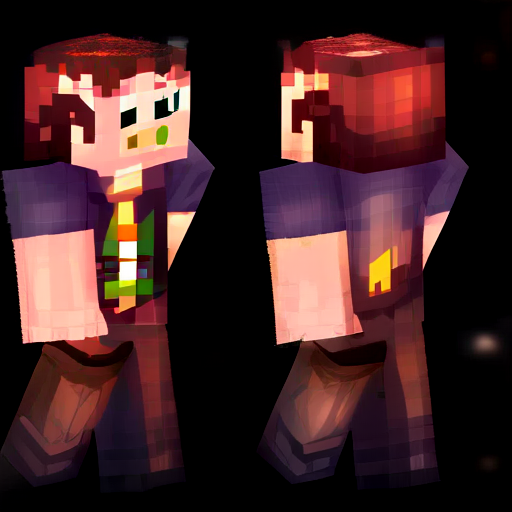 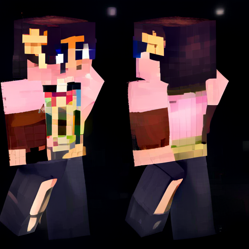

#### Full finetuning

Batch size: 8, Learning rate: 8e-5, Gives decent results in 500-1000 steps

| Batch Size | Gradient Accumulation Steps | Effective Total Batch Size | Memory Used |
|------------|-----------------------------|------------------|-------------|
|    8        |          1                   |     8             |      24.2 GB       |
|    4        |          2                   |     8             |      19.7 GB       |
|    1        |          8                   |     8             |      16.99 GB       |

```sh
accelerate launch training/train_amused.py \
    --output_dir <output path> \
    --train_batch_size <batch size> \
    --gradient_accumulation_steps <gradient accumulation steps> \
    --learning_rate 8e-5 \
    --pretrained_model_name_or_path amused/amused-512 \
    --instance_data_dataset  'monadical-labs/minecraft-preview' \
    --prompt_prefix 'minecraft ' \
    --image_key image \
    --prompt_key text \
    --resolution 512 \
    --mixed_precision fp16 \
    --lr_scheduler constant \
    --validation_prompts \
        'minecraft Avatar' \
        'minecraft character' \
        'minecraft' \
        'minecraft president' \
        'minecraft pig' \
    --max_train_steps 10000 \
    --checkpointing_steps 500 \
    --validation_steps 250 \
    --gradient_checkpointing
```

#### Full finetuning + 8 bit adam

Batch size: 8, Learning rate: 5e-6, Gives decent results in 500-1000 steps

| Batch Size | Gradient Accumulation Steps | Effective Total Batch Size | Memory Used |
|------------|-----------------------------|------------------|-------------|
|    8        |          1                   |     8             |      21.2 GB       |
|    4        |          2                   |     8             |      13.3 GB       |
|    1        |          8                   |     8             |      9.9 GB       |

```sh
accelerate launch training/train_amused.py \
    --output_dir <output path> \
    --train_batch_size <batch size> \
    --gradient_accumulation_steps <gradient accumulation steps> \
    --learning_rate 5e-6 \
    --pretrained_model_name_or_path amused/amused-512 \
    --instance_data_dataset  'monadical-labs/minecraft-preview' \
    --prompt_prefix 'minecraft ' \
    --image_key image \
    --prompt_key text \
    --resolution 512 \
    --mixed_precision fp16 \
    --lr_scheduler constant \
    --validation_prompts \
        'minecraft Avatar' \
        'minecraft character' \
        'minecraft' \
        'minecraft president' \
        'minecraft pig' \
    --max_train_steps 10000 \
    --checkpointing_steps 500 \
    --validation_steps 250 \
    --gradient_checkpointing
```

#### Full finetuning + lora 

Batch size: 8, Learning rate: 1e-4, Gives decent results in 500-1000 steps

| Batch Size | Gradient Accumulation Steps | Effective Total Batch Size | Memory Used |
|------------|-----------------------------|------------------|-------------|
|    8        |          1                   |     8             |      12.7 GB       |
|    4        |          2                   |     8             |      9.0 GB       |
|    1        |          8                   |     8             |      5.6 GB       |

```sh
accelerate launch training/train_amused.py \
    --output_dir <output path> \
    --train_batch_size <batch size> \
    --gradient_accumulation_steps <gradient accumulation steps> \
    --learning_rate 1e-4 \
    --use_lora \
    --pretrained_model_name_or_path amused/amused-512 \
    --instance_data_dataset  'monadical-labs/minecraft-preview' \
    --prompt_prefix 'minecraft ' \
    --image_key image \
    --prompt_key text \
    --resolution 512 \
    --mixed_precision fp16 \
    --lr_scheduler constant \
    --validation_prompts \
        'minecraft Avatar' \
        'minecraft character' \
        'minecraft' \
        'minecraft president' \
        'minecraft pig' \
    --max_train_steps 10000 \
    --checkpointing_steps 500 \
    --validation_steps 250 \
    --gradient_checkpointing
```

### Styledrop

[Styledrop](https://arxiv.org/abs/2306.00983) is an efficient finetuning method for learning a new style from a small number of images. It has an optional first stage to generate human picked additional training samples. The additional training samples can be used to augment the initial images. Our examples exclude the optional additional image selection stage and instead we just finetune on a single image.

This is our example style image:


#### 256

Example results:

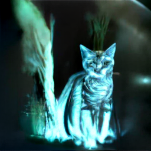 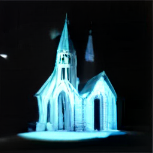 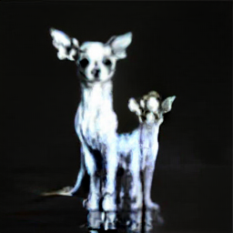

Learning rate: 4e-4, Gives decent results in 1500-2000 steps

Memory used: 6.5 GB 

```sh
accelerate launch ./training/train_amused.py \
    --output_dir <output path> \
    --mixed_precision fp16 \
    --report_to wandb \
    --use_lora \
    --pretrained_model_name_or_path amused/amused-256 \
    --train_batch_size 1 \
    --lr_scheduler constant \
    --learning_rate 4e-4 \
    --validation_prompts \
        'A chihuahua walking on the street in [V] style' \
        'A banana on the table in [V] style' \
        'A church on the street in [V] style' \
        'A tabby cat walking in the forest in [V] style' \
    --instance_data_image './training/A mushroom in [V] style.png' \
    --max_train_steps 10000 \
    --checkpointing_steps 500 \
    --validation_steps 100 \
    --resolution 256
```

#### 512

Example results:

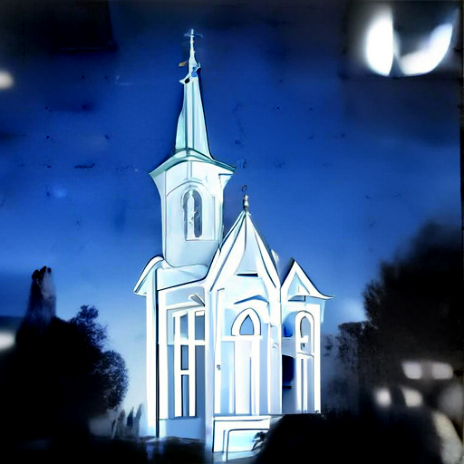 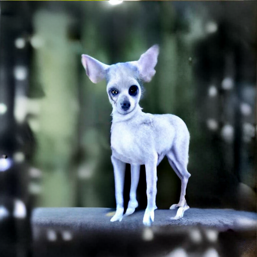 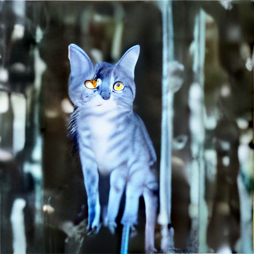

Learning rate: 1e-3, Lora alpha 1, Gives decent results in 1500-2000 steps

Memory used: 5.6 GB 

```
accelerate launch ./training/train_amused.py \
    --output_dir <output path> \
    --mixed_precision fp16 \
    --report_to wandb \
    --use_lora \
    --pretrained_model_name_or_path amused/amused-512 \
    --train_batch_size 1 \
    --lr_scheduler constant \
    --learning_rate 1e-3 \
    --validation_prompts \
        'A chihuahua walking on the street in [V] style' \
        'A banana on the table in [V] style' \
        'A church on the street in [V] style' \
        'A tabby cat walking in the forest in [V] style' \
    --instance_data_image './training/A mushroom in [V] style.png' \
    --max_train_steps 100000 \
    --checkpointing_steps 500 \
    --validation_steps 100 \
    --resolution 512 \
    --lora_alpha 1
```

## 4. Acknowledgements

TODO

## 5. Citation
```
@misc{patil-etal-2023-amused,
  author = {Suraj Patil and William Berman and Patrick von Platen},
  title = {Amused: An open MUSE model},
  year = {2023},
  publisher = {GitHub},
  journal = {GitHub repository},
  howpublished = {\url{https://github.com/huggingface/amused}}
}
```
