# amused

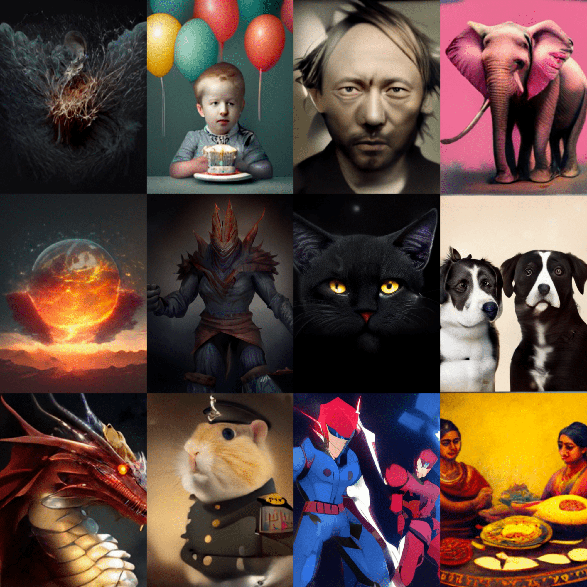
<sup><sub>Images cherry-picked from 512 and 256 models. Images are degraded to load faster. See ./assets/collage_full.png for originals</sub></sup>

[[Paper]]()
[[Models]]()
[[Colab]]()
[[Training Code]]()

| Model | Params |
|-------|--------|
| [amused-256](https://huggingface.co/openMUSE/diffusers-pipeline-256-finetuned) | 603M |
| [amused-512](https://huggingface.co/openMUSE/diffusers-pipeline) | 608M |

TODO - checkpoints

TODO - why/where to use amused

## 1. Usage

### Text to image

#### 256x256 model

```python
import torch
from diffusers import AmusedPipeline

pipe = AmusedPipeline.from_pretrained(
    "openMUSE/diffusers-pipeline-256-finetuned", torch_dtype=torch.float16
)  # TODO - fix path
pipe.vqvae.to(torch.float32)  # TODO - vqvae is producing nans in fp16
pipe = pipe.to("cuda")

prompt = "cowboy"
image = pipe(prompt, generator=torch.Generator('cuda').manual_seed(8)).images[0]
image.save('text2image_256.png')
```

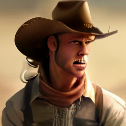

#### 512x512 model

```python
import torch
from diffusers import AmusedPipeline

pipe = AmusedPipeline.from_pretrained(
    "openMUSE/diffusers-pipeline", torch_dtype=torch.float16
)  # TODO - fix path
pipe.vqvae.to(torch.float32)  # TODO - vqvae is producing nans n fp16
pipe = pipe.to("cuda")

prompt = "summer in the mountains"
image = pipe(prompt, generator=torch.Generator('cuda').manual_seed(2)).images[0]
image.save('text2image_512.png')
```

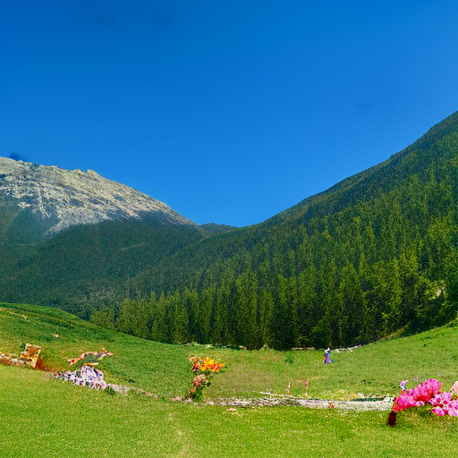

### Image to image

#### 256x256 model

```python
import torch
from diffusers import AmusedImg2ImgPipeline
from diffusers.utils import load_image

pipe = AmusedImg2ImgPipeline.from_pretrained(
    "openMUSE/diffusers-pipeline-256-finetuned", torch_dtype=torch.float16
)  # TODO - fix path
pipe.vqvae.to(torch.float32)  # TODO - vqvae is producing nans in fp16
pipe = pipe.to("cuda")

prompt = "apple watercolor"
input_image = (
    load_image(
        "https://raw.githubusercontent.com/huggingface/amused/main/assets/image2image_256_orig.png"
    )
    .resize((256, 256))
    .convert("RGB")
)

image = pipe(prompt, input_image, strength=0.7, generator=torch.Generator('cuda').manual_seed(3)).images[0]
image.save('image2image_256.png')
```

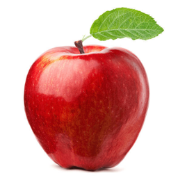 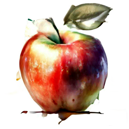

#### 512x512 model

```python
import torch
from diffusers import AmusedImg2ImgPipeline
from diffusers.utils import load_image

pipe = AmusedImg2ImgPipeline.from_pretrained(
    "openMUSE/diffusers-pipeline", torch_dtype=torch.float16
)  # TODO - fix path
pipe.vqvae.to(torch.float32)  # TODO - vqvae is producing nans in fp16
pipe = pipe.to("cuda")

prompt = "winter mountains"
input_image = (
    load_image(
        "https://raw.githubusercontent.com/huggingface/amused/main/assets/image2image_512_orig.png"
    )
    .resize((512, 512))
    .convert("RGB")
)

image = pipe(prompt, input_image, generator=torch.Generator('cuda').manual_seed(15)).images[0]
image.save('image2image_512.png')
```

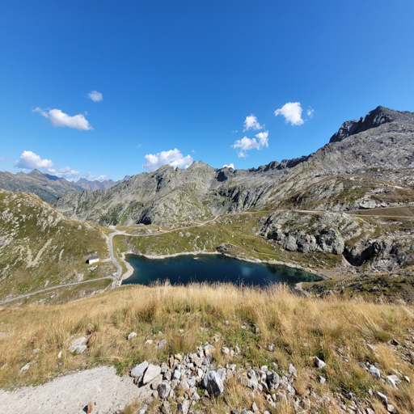 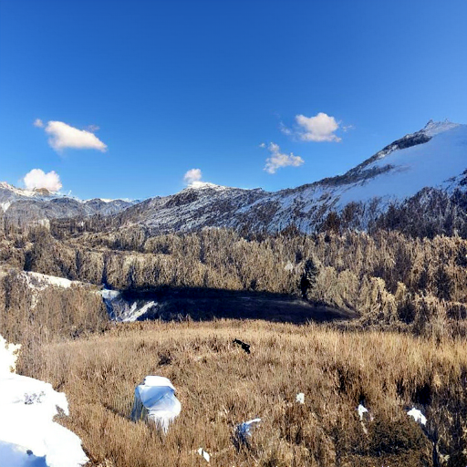

### Inpainting

#### 256x256 model

```python
import torch
from diffusers import AmusedInpaintPipeline
from diffusers.utils import load_image
from PIL import Image

pipe = AmusedInpaintPipeline.from_pretrained(
    "openMUSE/diffusers-pipeline-256-finetuned", torch_dtype=torch.float16
)  # TODO - fix path
pipe.vqvae.to(torch.float32)  # TODO - vqvae is producing nans with this example when in fp16
pipe = pipe.to("cuda")

prompt = "a man with glasses"
input_image = (
    load_image(
        "https://raw.githubusercontent.com/huggingface/amused/main/assets/inpainting_256_orig.png"
    )
    .resize((256, 256))
    .convert("RGB")
)
mask = (
    load_image(
        "https://raw.githubusercontent.com/huggingface/amused/main/assets/inpainting_256_mask.png"
    )
    .resize((256, 256))
    .convert("L")
)    

for seed in range(20):
    image = pipe(prompt, input_image, mask, generator=torch.Generator('cuda').manual_seed(seed)).images[0]
    image.save(f'inpainting_256_{seed}.png')

```

 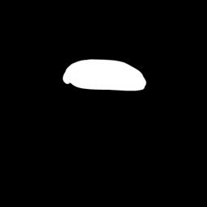 

#### 512x512 model

```python
import torch
from diffusers import AmusedInpaintPipeline
from diffusers.utils import load_image

pipe = AmusedInpaintPipeline.from_pretrained(
    "openMUSE/diffusers-pipeline", torch_dtype=torch.float16
)  # TODO - fix path
pipe.vqvae.to(torch.float32)  # TODO - vqvae is producing nans with this example when in fp16
pipe = pipe.to("cuda")

prompt = "fall mountains"
input_image = (
    load_image(
        "https://raw.githubusercontent.com/huggingface/amused/main/assets/inpainting_512_orig.jpeg"
    )
    .resize((512, 512))
    .convert("RGB")
)
mask = (
    load_image(
        "https://raw.githubusercontent.com/huggingface/amused/main/assets/inpainting_512_mask.png"
    )
    .resize((512, 512))
    .convert("L")
)
image = pipe(prompt, input_image, mask, generator=torch.Generator('cuda').manual_seed(0)).images[0]
image.save('inpainting_512.png')
```

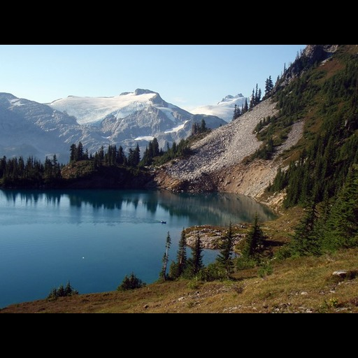 
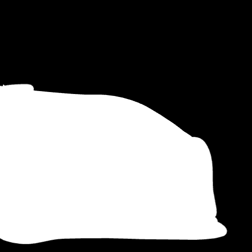 
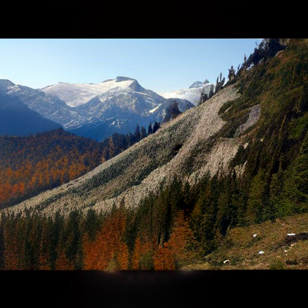

## 2. Performance

Amused inherits performance benefits from original [muse](https://arxiv.org/pdf/2301.00704.pdf). 

1. Parallel decoding: The model follows a denoising schedule that aims to unmask some percent of tokens at each denoising step. At each step, all masked tokens are predicted, and some number of tokens that the network is most confident about are unmasked. Because multiple tokens are predicted at once, we can generate a full 256x256 or 512x512 image in around 12 steps. In comparison, an autoregressive model must predict a single token at a time. Note that a 256x256 image with the 16x downsampled VAE that muse uses will have 256 tokens.

2. Fewer sampling steps: Compared to many diffusion models, muse requires fewer samples.

Additionally, amused uses the smaller CLIP as its text encoder instead of T5 compared to muse. Amused is also smaller with ~600M params compared the largest 3B param muse model. Note that being smaller, amused produces comparably lower quality results.

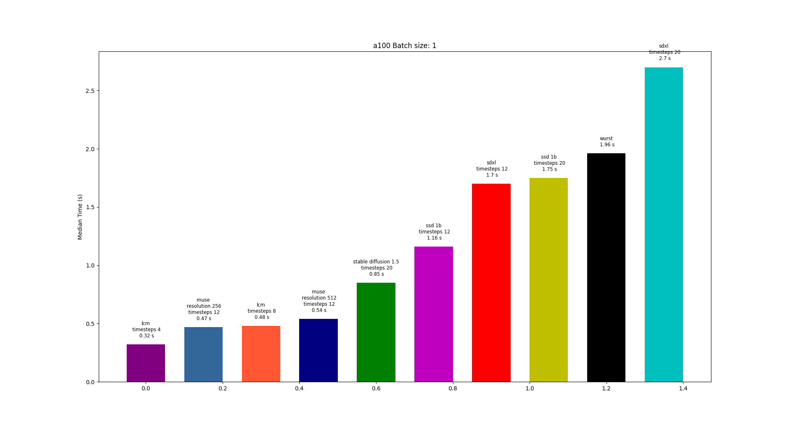
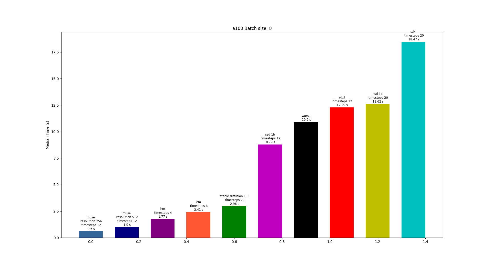
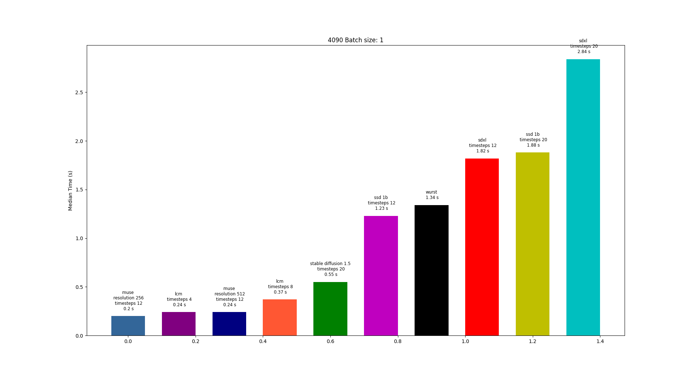
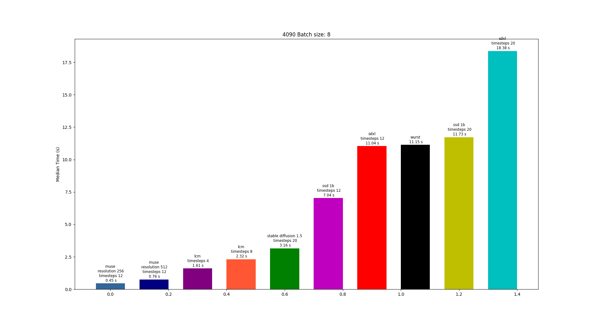

### Muse performance knobs

|                     | Uncompiled Transformer + regular attention | Uncompiled Transformer + flash attention (ms) | Compiled Transformer (ms) | Speed Up |
|---------------------|--------------------------------------------|-------------------------|----------------------|----------|
| 256 Batch Size 1    |                594.7                      |         507.7                |    212.1                  |   58%       |
| 512 Batch Size 1    |                637                      |        547                 |       249.9               |     54%     |
| 256 Batch Size 8    |                719                      |        628.6                 |        427.8              |    32%      |
| 512 Batch Size 8    |                  1000                    |         917.7                |       703.6               |    23%      |

Flash attention is enabled by default in the diffusers codebase through torch `F.scaled_dot_product_attention`

### torch.compile
To use torch.compile, simply wrap the transformer in torch.compile i.e.

```python
pipe.transformer = torch.compile(pipe.transformer)
```

Full snippet:

```python
import torch
from diffusers import AmusedPipeline

pipe = AmusedPipeline.from_pretrained(
    "openMUSE/diffusers-pipeline-256-finetuned", torch_dtype=torch.float16
)  # TODO - fix path

# HERE use torch.compile
pipe.transformer = torch.compile(pipe.transformer)

pipe.vqvae.to(torch.float32)  # TODO - vqvae is producing nans in fp16
pipe = pipe.to("cuda")

prompt = "cowboy"
image = pipe(prompt, generator=torch.Generator('cuda').manual_seed(8)).images[0]
image.save('text2image_256.png')
```

## 3. Training

### Styledrop

[Styledrop](https://arxiv.org/abs/2306.00983) is an efficient finetuning method for learning a new style.
It has an optional first stage to generates additional training samples. The additional training samples can
augment a small number of initial images such you need as little as 1 initial image.

#### Step 1

You need a small initial dataset of the style you want to teach the model. We will start with a single image.


All prompts should be of the form "<description of subject> in <identifier for style> style". The training script
uses the convention that the name of the file is its prompt. The identifier for the style can be the spelled out
name of the style e.g. "in a watercolor style". It can also be symbolic e.g. "[V]". Just keep the identifier consistent.

```sh
accelerate launch ./training/training.py \
    --output_dir <where to save checkpoints> \
    --mixed_precision fp16 \
    --report_to wandb \
    --use_lora \
    --pretrained_model_name_or_path openMUSE/diffusers-pipeline \
    --train_batch_size 1 \
    --lr_scheduler constant \
    --learning_rate 0.00003 \
    --validation_prompts \
        'A chihuahua walking on the street in [V] style' \
        'A banana on the table in [V] style' \
        'A church on the street in [V] style' \
        'A tabby cat walking in the forest in [V] style' \
    --instance_data_image './training/A woman working on a laptop in [V] style.jpg' \
    --max_train_steps 1000 \
    --checkpointing_steps 500 \
    --validation_steps 100
```

Generate a number of images and manually select those you think are of good quality. Select as many 
as you want but less than 12 is sufficient. Move the selected images and the initial image to a 
separate folder. 

```sh
python styledrop_generate_end_of_stage_1_images.py \
    --pretrained_model_name_or_path openMUSE/diffusers-pipeline \
    --write_images_to <where to save images> \
    --load_transformer_from <output_dir from step 1>
```

e.g.

TODO put images here

#### Step 2

Train the model on the selected images and the initial images.

```sh
accelerate launch training.py \
    --output_dir <same output_dir as step 1> \
    --instance_data_dir <the directory you moved the good images to> \
    --resume_from latest \
    --mixed_precision fp16 \
    --report_to wandb \
    --use_lora \
    --pretrained_model_name_or_path openMUSE/diffusers-pipeline \
    --train_batch_size 8 \
    --lr_scheduler constant \
    --learning_rate 0.00003 \
    --validation_prompts \
        'A chihuahua walking on the street in [V] style' \
        'A chihuahua walking on the street in [V] style' \
        'A banana on the table in [V] style' \
        'A church on the street in [V] style' \
        'A tabby cat walking in the forest in [V] style' \
    --max_train_steps 1000 \
    --checkpointing_steps 500 \
    --validation_steps 100
```

## 4. Acknowledgements

## 5. Citation
```
@misc{patil-etal-2023-amused,
  author = {Suraj Patil and William Berman and Patrick von Platen},
  title = {Amused: An open MUSE model},
  year = {2023},
  publisher = {GitHub},
  journal = {GitHub repository},
  howpublished = {\url{https://github.com/huggingface/amused}}
}
```
